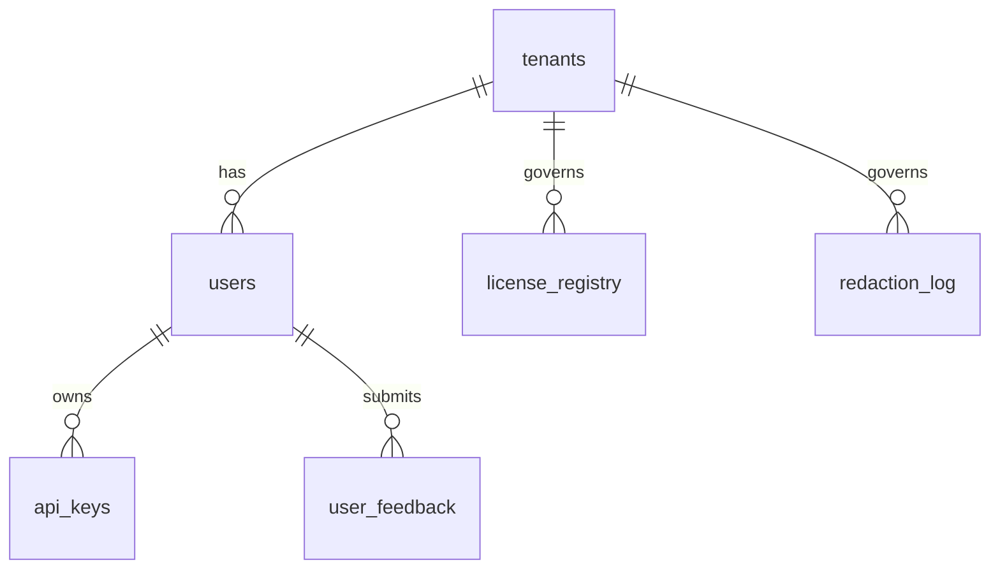

# Database Schema

Core tables overview and links to DDL.

- `cirs.tenants`, `cirs.users`, `cirs.api_keys`
- `cirs.user_feedback`, `cirs.finetune_corpus`
- `cirs.license_registry`, `cirs.redaction_log`
- Evaluation and alignment tables (see services)

