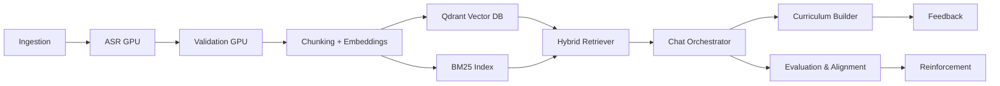

# CIRS Agent Documentation

Welcome to the CIRS Agent developer documentation.

- Overview of a local-first, GPU-accelerated RAG system for medical content.
- Milestones 3.0–3.9 implemented: UI, Monitoring, Evaluation, Alignment, Reinforcement, Security, Backup, Auth, CI/CD.

