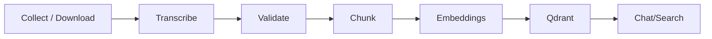

# Ingestion Pipeline User Guide (Non‑Technical)

This guide shows how to collect content (Instagram, YouTube, PDFs/EPUBs, other videos & audio), transcribe it, validate it, and index it for chat and search — entirely on your local machine.

- You do not need to code.
- You will run a few simple commands and place files in folders.

---

## 1) What the Ingestion Pipeline Does
- It downloads and organizes media (social, documents, videos, audio).
- It converts speech to text (transcription), cleans the text (validation), then breaks it into smaller “chunks” and creates searchable vectors (embeddings).
- It stores vectors in a local database (Qdrant) so the Chat feature can find and cite the right passages.

---

## 2) Prerequisites Checklist
- Windows 10/11, macOS, or Linux
- Docker Desktop installed and running
- NVIDIA GPU and NVIDIA Container Toolkit if you want GPU acceleration for ASR (optional but recommended)
- ffmpeg installed if you plan to do local media conversions (videos → audio)
- Disk space: at least 20 GB free for media + indexes
- Internet access for downloading sources (Instagram/YouTube) and model files

Tips:
- Windows: run PowerShell as a normal user (admin not required for most steps).
- macOS/Linux: run commands in Terminal.

---

## 3) Where Files Go (Folders You Use)
Base folder: your repository folder, referred to as `CIRS/`.

- Input folders for ingestion:
  - `CIRS/data/ingestion/instagram/`
  - `CIRS/data/ingestion/youtube/`
  - `CIRS/data/ingestion/other_videos/`
  - `CIRS/data/ingestion/epub/`
  - `CIRS/data/ingestion/pdf/`
  - `CIRS/data/ingestion/audios_files/`

- Outputs (produced automatically):
  - `/data/transcripts` – raw transcripts from audio/video
  - `/data/validated` – cleaned/validated text
  - `/data/chunks` – chunked text for indexing
  - Qdrant storage on disk (vector index) at `CIRS/data/qdrant/`

Note: When containers run, `./data` is mounted inside containers at `/data`.

---

## 4) .env Setup (Copy/Paste)
Create `CIRS/.env` (you already may have one). Minimal local setup:

```ini
# Core
DB_URL=postgresql://cirs:cirs@db:5432/cirs
QDRANT_URL=http://qdrant:6333

# Auth (local defaults)
AUTH_JWT_ALG=HS256
AUTH_JWT_SECRET=change_me
AUTH_ACCESS_TTL_MIN=15
AUTH_REFRESH_TTL_DAYS=14
TENANCY_DEFAULT_NAME=default

# Ingestion helpers (optional)
PYANNOTE_AUTH_TOKEN=hf_xxx          # only if you enable diarization
LLM_API_KEY=sk-xxx                  # only if validation/embeddings use a remote LLM
RUN_TAG=local-batch-1               # optional labeling
```

We run everything locally. You do NOT need GHCR or cloud registries.

---

## 5) How to Run Ingestion (Step‑by‑Step)
We’ll do this one folder at a time. Start with the base services that power indexing and search.

### 5.1 Start Base Services (DB + Vector DB)
- Windows PowerShell:
```powershell
cd C:\path\to\CIRS
docker compose -f compose.local.yml up -d --build db qdrant
```
- macOS/Linux bash:
```bash
cd ~/CIRS
docker compose -f compose.local.yml up -d --build db qdrant
```
Success criteria:
- Qdrant responds: open http://localhost:6333/collections

### 5.2 Put Media in the Right Folders
- Instagram reels → `data/ingestion/instagram/`
- YouTube videos → `data/ingestion/youtube/`
- PDFs → `data/ingestion/pdf/`
- EPUBs → `data/ingestion/epub/`
- Other videos → `data/ingestion/other_videos/`
- Audio → `data/ingestion/audios_files/`

### 5.3 Run Source‑Specific Ingestion (Examples)
These commands either download content or pick up local files and prepare them for processing.

- Instagram (Windows example):
```powershell
python backend\ingestion\instagram\main.py --input .\data\ingestion\instagram
```
- YouTube (macOS/Linux example):
```bash
python backend/ingestion/youtube/main.py --input ./data/ingestion/youtube
```
// PDFs & EPUBs (new): use docs_ingest to emit transcript sidecars
- Run both folders with auto-tag:
```bash
docker compose -f compose.local.yml run --rm docs_ingest
```
- Or target one and name the batch:
```bash
docker compose -f compose.local.yml run --rm docs_ingest --pdf-input /data/ingestion/pdf --tag docs_batch_01
docker compose -f compose.local.yml run --rm docs_ingest --epub-input /data/ingestion/epub --tag docs_batch_01
```
Notes:
- If Instagram requires login/cookies, place your cookies file as instructed by that tool’s README and retry.
- For local PDFs/EPUBs/videos/audio, you often just need to place files in the correct folders; the pipeline will pick them up in processing.

### 5.4 Process Media → Transcripts → Validation → Chunks + Embeddings
This runs the ASR (transcription), validation, and indexing steps. The services support the following flags (from the code):

- `asr_gpu` (`backend/transcription/asr_gpu/main.py`)
  - Flags: `--input` (defaults to `INPUT_PATH` env or `/data/ingestion`), `--tag`, `--source-id`
  - Env: `INPUT_PATH`, `OUTPUT_PATH`, `RUN_TAG`, `ASR_MODEL`, `ASR_COMPUTE_TYPE`, `ASR_DIARIZATION`, `PYANNOTE_AUTH_TOKEN`
- `validation_gpu` (`backend/processing/validation_gpu/main.py`)
  - Flags: `--input` (defaults to `INPUT_PATH` env or `/data/transcripts`), `--tag`, `--source-id`
  - Env: `INPUT_PATH`, `OUTPUT_PATH`, `RUN_TAG`, `VALIDATION_MODEL`, `VALIDATION_THRESHOLD`
- `chunking_embeddings_gpu` (`backend/processing/chunking_embeddings_gpu/main.py`)
  - Flags: `--input` (defaults to `INPUT_PATH` env or `/data/validated`), `--tag`
  - Env: `INPUT_PATH`, `OUTPUT_PATH`, `RUN_TAG`, `EMBED_MODEL`, `EMBED_BATCH_SIZE`, `QDRANT_URL`, `QDRANT_COLLECTION`

- macOS/Linux or Windows (PowerShell works similarly via `docker compose`):
```bash
# Transcription (GPU if available) — scan default /data/ingestion
docker compose -f compose.local.yml run --rm asr_gpu
# Or explicitly scope and tag
docker compose -f compose.local.yml run --rm asr_gpu --input /data/ingestion/audios_files --tag batch_01
# Optionally attach a source ID (FK in DB if used)
docker compose -f compose.local.yml run --rm asr_gpu --input /data/ingestion/other_videos --source-id SRC_123

# Validation (medical QA rules) — scan default /data/transcripts
docker compose -f compose.local.yml run --rm validation_gpu
# Or explicitly scope and tag
docker compose -f compose.local.yml run --rm validation_gpu --input /data/transcripts/videos/versions/batch_01 --tag val_batch_01

# Chunking + embeddings (vectors → Qdrant) — scan default /data/validated
docker compose -f compose.local.yml run --rm chunking_embeddings_gpu
# Or explicitly scope and tag
docker compose -f compose.local.yml run --rm chunking_embeddings_gpu --input /data/validated/videos/val_batch_01 --tag embed_batch_01
```

#### 5.4.1 Process Only A Specific Folder (Scoping)
You can restrict processing to one folder (e.g., only audio batch) instead of scanning all of `/data/ingestion`.

- **Option A — Pass an input path (supported by all three services)**
  - Windows PowerShell:
    ```powershell
    docker compose -f compose.local.yml run --rm asr_gpu --input /data/ingestion/audios_files
    docker compose -f compose.local.yml run --rm validation_gpu --input /data/ingestion/audios_files
    docker compose -f compose.local.yml run --rm chunking_embeddings_gpu --input /data/ingestion/audios_files
    ```
  - macOS/Linux bash:
    ```bash
    docker compose -f compose.local.yml run --rm asr_gpu --input /data/ingestion/audios_files
    docker compose -f compose.local.yml run --rm validation_gpu --input /data/ingestion/audios_files
    docker compose -f compose.local.yml run --rm chunking_embeddings_gpu --input /data/ingestion/audios_files
    ```

- **Option B — Use an env var (INPUT_PATH; supported by all three services)**
  - Windows PowerShell:
    ```powershell
    docker compose -f compose.local.yml run --rm -e INPUT_PATH=/data/ingestion/audios_files asr_gpu
    docker compose -f compose.local.yml run --rm -e INPUT_PATH=/data/ingestion/audios_files validation_gpu
    docker compose -f compose.local.yml run --rm -e INPUT_PATH=/data/ingestion/audios_files chunking_embeddings_gpu
    ```
  - macOS/Linux bash:
    ```bash
    docker compose -f compose.local.yml run --rm -e INPUT_PATH=/data/ingestion/audios_files asr_gpu
    docker compose -f compose.local.yml run --rm -e INPUT_PATH=/data/ingestion/audios_files validation_gpu
    docker compose -f compose.local.yml run --rm -e INPUT_PATH=/data/ingestion/audios_files chunking_embeddings_gpu
    ```

- **Option C — Volume override (works even when flags/env aren’t available)**
  - Windows PowerShell:
    ```powershell
    docker compose -f compose.local.yml run --rm `
      -v ${PWD}\data\ingestion\audios_files:/data/ingestion:ro `
      asr_gpu
    ```
    Repeat similarly for `validation_gpu` and `chunking_embeddings_gpu`.
  - macOS/Linux bash:
    ```bash
    docker compose -f compose.local.yml run --rm \
      -v "$(pwd)/data/ingestion/audios_files:/data/ingestion:ro" \
      asr_gpu
    ```

Notes:
- All three services accept `--input` and honor `INPUT_PATH`.
- Replace `audios_files` with `pdf`, `epub`, or `other_videos` to scope those batches.
Success criteria:
- New files in `CIRS/data/transcripts/`, `CIRS/data/validated/`, and `CIRS/data/chunks/`.
- Qdrant collections show increasing `points_count`.

### 5.5 Rebuild the Lexical Index & Test Retrieval
```bash
curl -X POST http://localhost:8002/rebuild-index
curl "http://localhost:8002/search?q=neuroinflammation&mode=hybrid"
```
Success criteria:
- Search returns results with snippets and source links.

### 5.6 Chat Test
```bash
curl -X POST http://localhost:8003/chat \
  -H "Content-Type: application/json" \
  -d '{"query":"What are common CIRS symptoms?"}'
```
Or open the UI (if running): `http://localhost:5173`

---

## 6) Scheduler Setup (Optional)
Run the pipeline on a schedule so new items are processed automatically.

- Option A: Built‑in scheduler service (if provided in your compose). Ask your admin to enable the `scheduler` service which periodically runs the same commands as above.

- Option B: OS Scheduler
  - Windows Task Scheduler (plain‑English steps):
    1. Open Task Scheduler → Create Basic Task → Name: “CIRS ASR”
    2. Trigger: Daily or Hourly
    3. Action: Start a program
    4. Program/script: `docker`
    5. Add arguments: `compose -f compose.local.yml run --rm asr_gpu`
    6. Start in: `C:\path\to\CIRS`
    7. Finish and enable the task.
    Repeat for `validation_gpu` and `chunking_embeddings_gpu` with different times (e.g., stagger every 15 minutes).

  - cron (macOS/Linux):
```bash
crontab -e
# Every 30 minutes: ASR
*/30 * * * * cd ~/CIRS && /usr/bin/docker compose -f compose.local.yml run --rm asr_gpu >> scheduler.log 2>&1
# Every 45 minutes: Validation
*/45 * * * * cd ~/CIRS && /usr/bin/docker compose -f compose.local.yml run --rm validation_gpu >> scheduler.log 2>&1
# Hourly: Chunking + Embeddings
0 * * * *    cd ~/CIRS && /usr/bin/docker compose -f compose.local.yml run --rm chunking_embeddings_gpu >> scheduler.log 2>&1
```
How it avoids duplicates:
- The pipeline keeps sidecar JSON and checksums (SHA256) to determine if a file or URL was already processed; unchanged items are skipped.

---

## 7) How the Pipeline Works (Simple)
1. Ingestion: Download/collect items and metadata.
2. Transcription: Convert speech → text (videos/audio).
3. Validation: Clean and improve text for medical QA.
4. Chunking + Embeddings: Break text into passages and compute vectors.
5. Retrieval: The Chat tool uses vectors + keywords to find relevant passages.

Provenance: Every chunk stores the source (URL/file path) and position (timestamp/page) so answers can cite their origin.

---

## 8) Verification Checklist
- Files appeared in `data/transcripts/`, `data/validated/`, `data/chunks/`.
- Qdrant shows collections at http://localhost:6333/collections.
- `/search` returns results for real queries.
- Chat answers reference your ingested items.

---

## 9) Common Tasks & Recipes
- Ingest a new Instagram account: place inputs in `data/ingestion/instagram/` and run the Instagram command (5.3); then run 5.4 processing steps.
- Add a YouTube channel: place links or use your YouTube ingestion command in `data/ingestion/youtube/`, then run 5.4.
- Batch import a folder of PDFs: copy files into `data/ingestion/pdf/` and run 5.4 (skip ASR if text‑only).
- Re‑run transcription only for failed items: rerun the `asr_gpu` step; the pipeline skips already complete items.
- Remove an item and rebuild the index: remove from `data/transcripts` and related outputs, then rerun chunking/embeddings and `rebuild-index`.

---

## 10) Troubleshooting (Friendly)
- GPU not detected: ensure NVIDIA drivers + NVIDIA Container Toolkit; test with `docker run --rm --gpus all nvidia/cuda:12.2.2-base-ubuntu22.04 nvidia-smi`.
- ffmpeg or yt‑dlp issues: install/update ffmpeg; update video tools if you download from YouTube/Instagram.
- No results in search: verify collections exist in Qdrant; ensure chunking/embeddings step ran successfully.
- Permissions/paths (Windows vs macOS/Linux): prefer ASCII paths; avoid spaces in directory names.
- Auth/token errors for diarization models: `PYANNOTE_AUTH_TOKEN` may be required; see model page for access.

---

## 11) FAQ & Glossary
- Transcript: The text extracted from audio/video.
- Chunk: A small passage of text used for retrieval.
- Qdrant: A local vector database that stores embeddings.
- How often should I run the scheduler? Start hourly for ingestion; adjust based on volume.
- How big can files be? Large files work but take longer; ensure free disk space.

---

## 12) Safety & Licensing Notes
- License metadata is captured where available; use content according to original licenses.
- PII redaction (if enabled) runs before indexing. It reduces exposure but is not guaranteed to remove all sensitive data — review outputs as needed.

---

## 13) Diagram


---

## Undo/Reset
- Stop services: `docker compose -f compose.local.yml down`
- Clean caches safely: remove files under `data/ingestion/*` you no longer want; keep `data/qdrant/` to preserve your index unless you intend to rebuild it.

---

## If You’re Stuck
- Check the Docs service (if running): `http://localhost:8020`
- View container logs: `docker compose logs -f <service>`
- Health endpoints:
  - Qdrant: `http://localhost:6333/collections`
  - Retriever: `http://localhost:8002/health`
  - Chat Orchestrator: `http://localhost:8003/health`

---

_Last updated: 2025-10-20_
